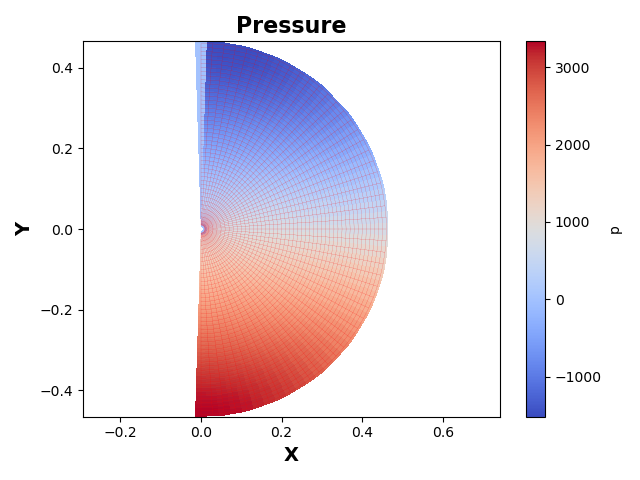
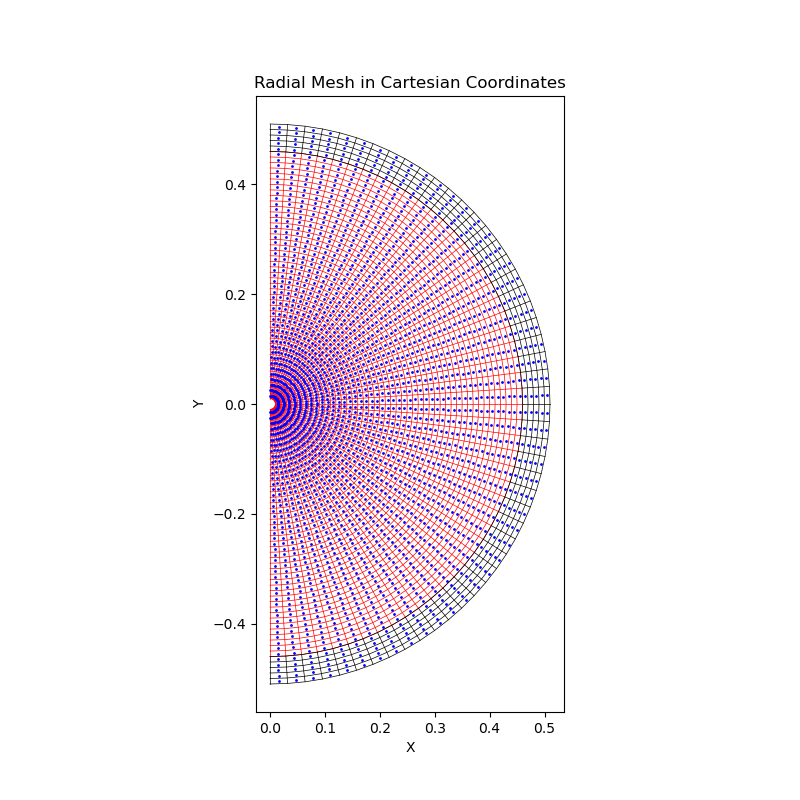
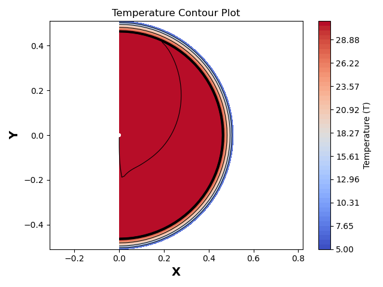
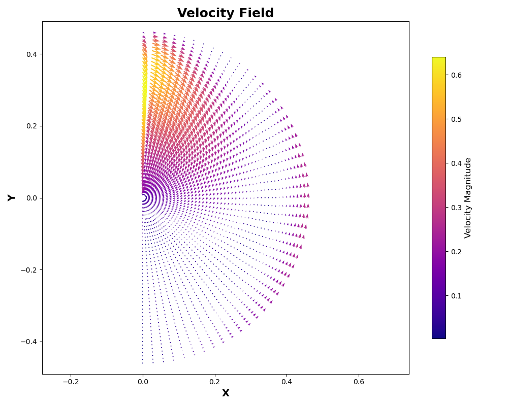
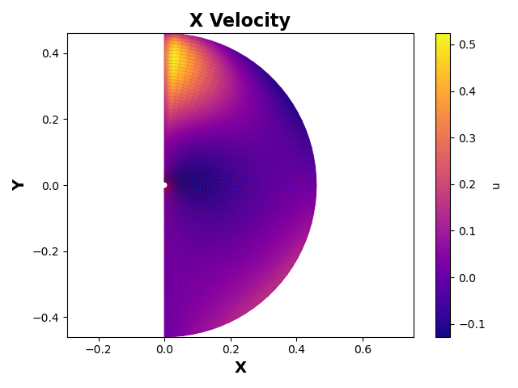
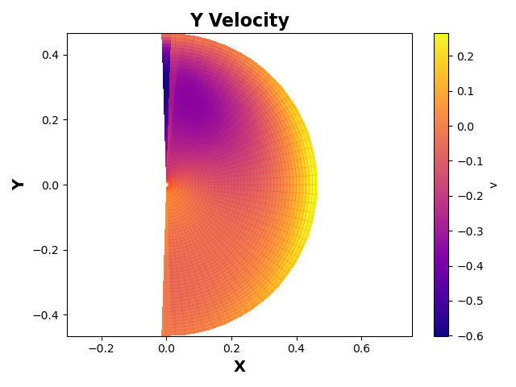
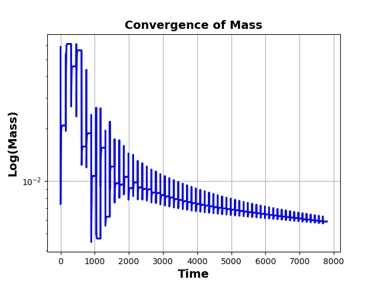
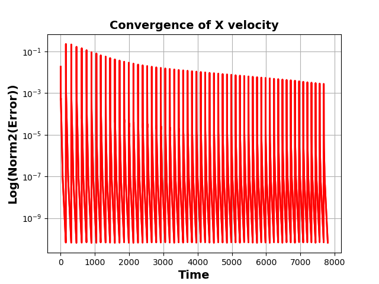
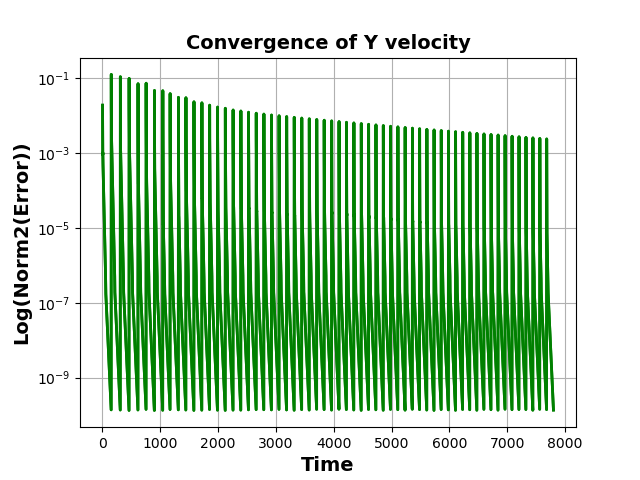

# Insulating Layer PISO Solver

## 项目简介

该项目实现了一个使用 PISO 方法求解绝缘层内流体动力学和热传递的有限体积法 (FVM) 求解器。项目包括通过 Python 编写的 FVM 代码来模拟流体的速度场、压力场以及温度分布。所有的计算均基于径向网格，并生成相应的图像来展示计算结果。

## 文件结构

## 文件结构

- [`MeshFVM.py`](./MeshFVM.py)：用于生成径向网格并定义网格参数。
  - `MeshStructure` 类：定义网格结构。
  - `MeshGenerator` 类：生成不同类型的网格，包括均匀网格、径向网格和非均匀网格。
- [`NS_FVM.py`](./NS_FVM.py)：求解 Navier-Stokes 方程的核心代码，实现了速度、压力的计算。
  - 包含物理模型参数和数值模拟参数的设置。
  - 创建径向网格并进行坐标转换。
  - 初始化变量和边界条件。
  - 迭代求解 Navier-Stokes 方程并生成结果图像。
- [`solver.py`](./solver.py)：调用 Navier-Stokes 求解器并处理温度场的求解。
  - 包含多个求解器函数，如 `U_Solver`、`V_Solver`、`T_Solver` 和 `P_Solver`。
  - 使用并行化和优化技术加速计算。
- [`Pressure.png`](./Pressure.png)：压力场分布图。
- [`RadialMesh.png`](./RadialMesh.png)：径向网格的可视化。
- [`Temperature.png`](./Temperature.png)：温度分布图。
- [`VelocityQuiver.png`](./VelocityQuiver.png)：速度场矢量图。
- [`XVelocity.png`](./XVelocity.png)：X方向速度场分布图。
- [`YVelocity.png`](./YVelocity.png)：Y方向速度场分布图。
- [`MassResidual.png`](./MassResidual.png)：质量残差图。
- [`XvelocityResidual.png`](./XvelocityResidual.png)：X方向速度残差图。
- [`YvelocityResidual.png`](./YvelocityResidual.png)：Y方向速度残差图。


## 依赖项

运行该项目需要以下依赖库：

```bash
pip install numpy matplotlib scipy numba
```

## 安装指南

1. 克隆该项目到本地：

```bash
git clone https://github.com/sherlockyzd/Insulating_layer_PISO.git
cd Insulating_layer_PISO
```

2. 安装依赖库：

```bash
pip install numpy matplotlib scipy numba
```

## 使用说明

1. 运行 [`NS_FVM.py`](./NS_FVM.py) 文件以生成径向网格并初始化变量：

```bash
python NS_FVM.py
```

2. 生成的图像将保存在项目目录中，包括压力场分布图、速度场分布图和温度分布图等。

## 示例输出

以下是一些示例输出图像：
以下是一些示例输出图像：

- 压力场分布图：
  
  
- 径向网格的可视化：
  
  
- 温度分布图：
  
  
- 速度场矢量图：
  
  
- X方向速度场分布图：
  
  
- Y方向速度场分布图：
  
  
- 质量残差图：
  
  
- X方向速度残差图：
  
  
- Y方向速度残差图：
  

## 贡献指南

如果你想为该项目做出贡献，请遵循以下步骤：

1. Fork 该项目。
2. 创建一个新的分支：

```bash
git checkout -b feature-branch
```

3. 提交你的更改：

```bash
git commit -am 'Add some feature'
```

4. 推送到分支：

```bash
git push origin feature-branch
```

5. 创建一个新的 Pull Request。

## 许可证

该项目使用 MIT 许可证。详情请参阅 LICENSE 文件。
